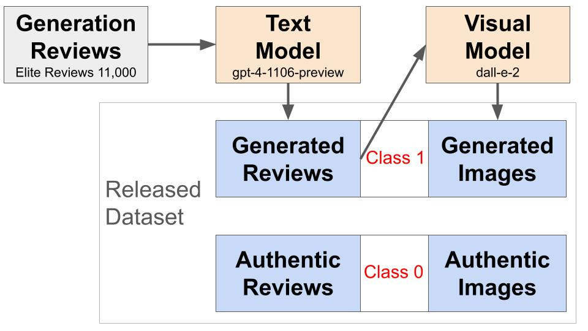

# AiGen-FoodReview 

AiGen-FoodReview is a multimodal dataset of machine-generated fake restaurant reviews and images.
The dataset is divided into 3 splits: training (60%), validation (20%), and test (20%), named train.csv, val.csv, and test.csv, respectively. 

## Data Generation Methodology

## Variable Description
Images are available to download at [link](https://drive.google.com/file/d/1FzBIklsUkNaBKdCWvjbeb3h4PH1zUI3Q/view?usp=sharing).
Each image is named "ID.jpg", mapping to each review. 

Features description: 

- ID: Unique identifier. It maps to each review, either generated or authentic, and to each image. 
- text: Review text.
- label: Binary label indicating the class (0=authentic, 1=machine-generated).
- automated_readability_index: Approximate US grade level needed to comprehend the text.
- difficult_words: Number of difficult words from Dale-Chall world list.
- flesch_reading_ease: Score on a scale from 0 to 100, with higher scores indicating easier readability.
- gunning_fog: Years of formal education a person needs to understand a text easily.
- words_per_sentence: Average number of words per sentence. 
- reading_time: Reading time.
- ppl: Perplexity score from zero-shot GPTNeo 125M. 
- bright: Brightness. Average of V of the HSV image representation.
- sat: Saturation. Color intensity and purity of an image. Average of S of the HSV image representation.
- clar: Clarity. Well-defined objects in space. % of normalized V pixels that exceed 0.7 of HSV.
- cont: Contrast. Spread of illumination. Standard deviation of V of the HSV image representation.
- warm: Warmth. Warm colors: from red to yellow. % of H<60 or $>$ than 220 of HSV.
- colorf: Colorfulness. Departure from a grey-scale image.
- sd: Size difference. Difference in the number of pixels between the figure and the ground
- cd: Color difference. Difference of Euclidian distance between the figure and ground (RGB vectors).
- td: Texture difference. Absolute difference between the foreground and background edge density.
- diag_dom: Diagonal dominance. Manhattan distance between salient region and each diagonal.
- rot: Rule of thirds. Minimum distance between center of salient region and each of the four intersection points.
- hpvb: Horizontal physical visual balance. Split image horizontally. Horizontal physical symmetry (mirroring).
- vpvb: Vertical physical visual balance. Split image vertically. Vertical physical symmetry (mirroring)
- hcvb: Horizontal color visual balance. Split image horizontally. Horizontal mirrored Euclidean cross-pixels distance.
- vcvb: Vertical color visual balance. Split image vertically. Vertical mirrored Euclidean cross-pixels distance.

Textual features were mined using [textstat](https://pypi.org/project/textstat/), while an explanation of viusal feautures can be found at [Gambetti&Han2022](https://www.emerald.com/insight/content/doi/10.1108/IJCHM-09-2021-1206/full/html).

## Training and Evaluation
Training and evaluation python scripts are available for text (BERT, GPTNeo), vision (ViT, ResNet), and multimodal models (FLAVA, CLIP). Each script comes with a CONFIG section in the beginning, with path and configuration parameters to be inserted. Optimized weights for each model are accessible at this [link](https://drive.google.com/file/d/1aYz5G6z9BL7mv9dL-JV2iay25EuKbgqn/view?usp=sharing). 

## Authors
- [Alessandro Gambetti](https://scholar.google.com/citations?user=F0MfEx8AAAAJ&hl=en)
- [Qiwei Han](https://scholar.google.com/citations?user=koBWI88AAAAJ&hl=en)